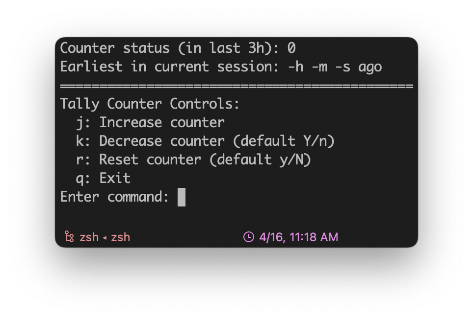
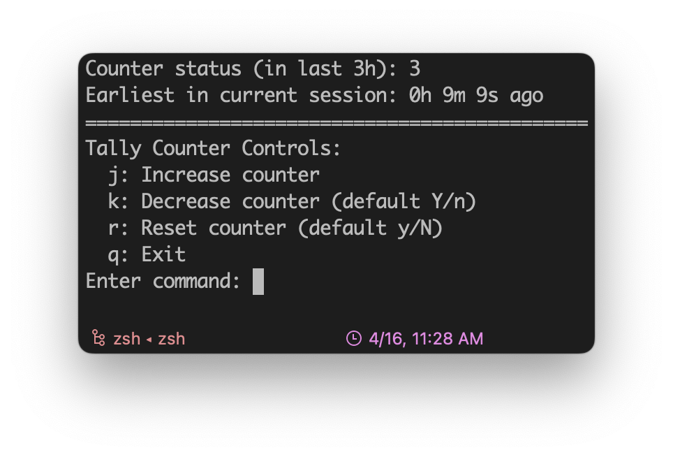

# Tally Counter

A simple Python Tally Counter with timestamp to keep track of ChatGPT (e.g., GPT-4) interactions, and many more.

## What is it?

It is a handy tool to keep track of the number of events of interest in last `X` hours (can be edited in `TallyCounter.py`, here default is 3 hours).

## Example usage?

For [ChatGPT (GPT-4)](https://chat.openai.com/?model=gpt-4), there is a cap of usage, e.g., 
> "GPT-4 currently has a cap of 25 messages every 3 hours."

To avoid accidentally exceeding the interaction limit and having to wait for 3 hours before another conversation, keep track of the count of total interactions within the past 3 hours.

## How to run?

- Open terminal, go to the location where `TallyCounter.py` is saved, just run:
  ```python
  python TallyCounter.py
  ```

- The counter shows following information very concisely:
  - The total number of events in last 3 hours
  - The timestamp of the earliest conversations in last 3 hours
  - Events earlier than 3 hours will be ignored


  
- The control is pretty straightforward:
  - input `j` (`j` + `Enter`) to increase the counter
  - input `k` (`k` + `Enter`) to decrease the counter (ask for confirmation, default to YES)
  - input `r` (`r` + `Enter`) to restart the counter (ask for confirmation, default to NO)
  - input `q` (`q` + `Enter`) to exit
  - input anything else (e.g., `Enter`) to see the latest status



- An example workflow:
  - since there is no built-in counter on [ChatGPT](https://chat.openai.com/?model=gpt-4), just keep a small Terminal window running Tally Counter, and then:
  Chat with GPT -> `j` + `Enter` (counter + 1) in Tally Counter -> ...
